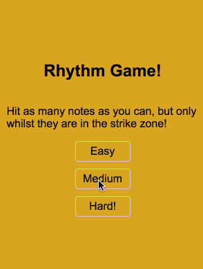

# CSS Rhythm Game

A super simple "rhythm" game (with no sound) built entirely out of HTML and CSS (no Javascript at all!).



## Why?

I've been building a series of these silly experiments to explore what is possible using only CSS on a page.

It's a fun experiment, trying to build features into something when you have a ton of restrictions. It forced me to learn a little about CSS, but mostly, this is just for fun, to show that it's possible.

## How does it work?

This experiment is actually very simple, even compared to some of my older ones.

The menus work similarly to [CSS](https://github.com/lukebatchelor/css-tic-tac-toe) and [Binary Decoder](https://github.com/lukebatchelor/css-binary-decoder) experiments. There are a set of radio buttons representing the current "state".

```html
<input type="radio" name="game-state" id="start" checked>
<input type="radio" name="game-state" id="playing-easy">
<input type="radio" name="game-state" id="playing-med">
<input type="radio" name="game-state" id="playing-hard">
```

Only one can be selected at a time, and we use these to decide which screen to show

```less
.startScreen, .playingScreen, .gameOverScreen {
  display: none;
}
#start:checked ~ #game .startScreen {
  display: flex;
}
#playing-easy:checked ~ #game .playingScreen {
  display: block;
  // The delay time here changes depending on if easy, medium or hard mode
  animation: hide 0.1s linear 45s forwards;
}
#playing-easy:checked ~ #game .gameOverScreen {
  display: flex;
  opacity: 0;
  // Delay showing the gameover screen until the same amount of time as the play time above
  animation: show 0.1s linear 45s forwards;
}
```

The playing screens are also simple. We have a `clickGuard` class that sits over the
top of everything and prevents clicks from reaching the `hitBoxes`. 

Then a `level` which we apply the playing animation, simply translating itself downwards over a 
pre-determined amount of time.

Inside `level` is a series of `hitoxes` (styled checkboxes) that are generated at random top offsets.

```html
<div class="playingScreen">
  <div class="clickGuard"></div>
  <div class="level">
    <input type="checkbox" class="hitbox col3" style="top: -200px"></input>
    <input type="checkbox" class="hitbox col3" style="top: -300px"></input>
    <input type="checkbox" class="hitbox col4" style="top: -450px"></input>
    <!-- ... -->
  </div>
  <div class="hitboxIndicator col1"></div>
  <div class="hitboxIndicator col2"></div>
  <div class="hitboxIndicator col3"></div>
  <div class="hitboxIndicator col4"></div>
  <div class="scoreBoard"></div>
  <div class="streakBoard"></div>
</div>
```

At the bottom you'll see the  `hitboxIndicator`s, `scoreBoard` and `streakBoard`. They
are the static parts of the game for showing where you can click, and for displaying score/streaks.

Scores and streaks are implemented using [CSS counters](https://developer.mozilla.org/en-US/docs/Web/CSS/CSS_Lists_and_Counters/Using_CSS_counters). The logic for these is below.

```less
#game {
  // ...hidden for brevity
  counter-reset: score streak;
}

.hitbox:checked {
  counter-increment: score;  // Increase our score counter
  pointer-events: none;      // Don't let us uncheck a checked box
  animation: hitAnim 0.3s;
}

// Each time we miss a box, then hit the next one, restart our streak counter
// because we must have missed one
.hitbox:first-of-type:checked,
.hitbox:not(:checked) + .hitbox:checked {
  counter-reset: streak;
  counter-increment: score streak;
}
// Since it resets every time we miss one and start a new streak, we simply
// increment every time we have two checked boxes in a row
.hitbox:checked + .hitbox:checked {
  // Note: We must increment BOTH counters here as this rule will trump the
  // normal score incrementing
  counter-increment: score streak;
}

// Displaying our score
.scoreBoard::after {
  display: block;
  content: "Score: " counter(score);
}
// Displaying our streak
.streakBoard::after {
  display: block;
  content: "Streak: " counter(streak) "x";
}
```

Similar to all the above, the `gameOverScreen` has elements we can select to
write our counters to, and a reset button to restart the game. This works by clearing
the whole form the game is inside of and returning us to the first menu.

```html
<div class="gameOverScreen">
  <h2>Game Over!</h2>
  <p id="game-over-score"></p>
  <p id="game-over-streak"></p>
  <input type="reset" id="resetButton" class="playButton" value="Play Again!"></input>
</div>
```

## Future ideas


**Randomisation**

Currently the order of the notes is randomised every time we rebuild/deploy but this isn't fun if
you're playing a bunch of times. It should be pretty easy to trick the user into thinking the game is random
by having the `startScreen` actually be constantly animating between `X` different start screens that take you to `X` different generated levels. With a high enough `X`, this will likely be indistinguishable from random.

**Optimization**

The game currently generates `400` notes in the level, most of which wont ever be reachable. We could fiddle with these numbers, finding the maximum number we need to be able to display for a random game of `Y` seconds.

This would give us a smaller page load, or give us more data we can use for the optimization above!

**Perspective shift**

I played with the idea of doing a Guitar Hero style perspective shift so that the notes appear to be coming out of a vanishing point as they come towards you. I ran into some issues with it, but this should 100% be achievable.

**Highscore/MaxStreak**

I'd love to find a way to be able to store some sort of "Highscore" (in one session) or "Max Streak" (in one game).

I have tried a few ways of achieving maxStreak using counters, and I don't think it's going to be viable.

A better solution would be if we could do something like:

```less
// Simplfied obviously
.hitbox:not(:checked) + .hitbox:checked ~ .streakBoard::after {
  display: block;
  content: "Max streak: 1x";
}
.hitbox:not(:checked) + .hitbox:checked + .hitbox:checked ~ .streakBoard::after {
  display: block;
  content: "Max streak: 2x";
}
.hitbox:not(:checked) + .hitbox:checked + .hitbox:checked + .hitbox:checked ~ .streakBoard::after {
  display: block;
  content: "Max streak: 3x";
}
// ... ...
```

The rules get more and more specific as you go, so they would trump each time.

The hard part here is getting a sibling element we can target that is going to not be moved by the transforming... A hacky solution might be to reverse the animation happening to the level, on the `streakBoard`.